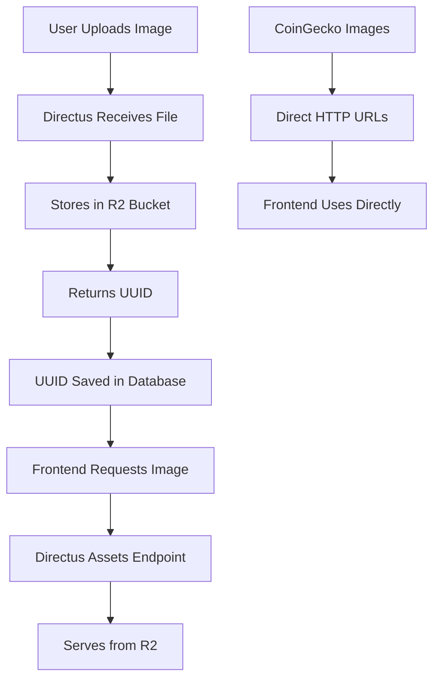

# Lore.meme Directus Backend with Cloudflare R2 Storage

This directory contains the Directus backend configuration for the Lore.meme platform, configured to use Cloudflare R2 for image storage.

## 🚀 Quick Start

1. **Copy environment file:**
   ```bash
   cp .env.example .env
   ```

2. **Configure your settings in `.env`:**
   - Update Cloudflare R2 credentials
   - Set your domain for `PUBLIC_URL`
   - Change default admin credentials

3. **Start the services:**
   ```bash
   ./start.sh
   ```

## 📋 Prerequisites

- Docker and Docker Compose installed
- Cloudflare R2 bucket configured
- R2 API credentials

## 🔧 Configuration

### Cloudflare R2 Setup

The following environment variables configure R2 storage:

```env
STORAGE_LOCATIONS=s3
STORAGE_S3_DRIVER=s3
STORAGE_S3_KEY=your_r2_access_key_id
STORAGE_S3_SECRET=your_r2_secret_access_key
STORAGE_S3_BUCKET=your_r2_bucket_name
STORAGE_S3_REGION=auto
STORAGE_S3_ENDPOINT=https://your_account_id.r2.cloudflarestorage.com
STORAGE_S3_FORCE_PATH_STYLE=true
```

### Image URL Handling

The system handles two types of images:

1. **CoinGecko Images**: Full HTTP URLs used directly
2. **User Uploads**: UUIDs converted to Directus assets URLs

Example transformation:
- UUID: `89d1bf47-2dbb-497f-8f97-4608813bfbed`
- Frontend URL: `http://localhost:8055/assets/89d1bf47-2dbb-497f-8f97-4608813bfbed`
- Served from: Cloudflare R2 bucket

## 🌐 Services

After starting, the following services will be available:

- **Directus Admin**: http://localhost:8055
- **PgAdmin**: http://localhost:5050 (optional database management)

### Default Credentials

**Directus Admin:**
- Email: `admin@example.com`
- Password: `d1r3ctu5`

**PgAdmin:**
- Email: `admin@example.com`
- Password: `admin`

## 📁 Directory Structure

```
lm-back/directus/
├── docker-compose.yml    # Docker services configuration
├── Dockerfile           # Custom Directus image
├── .env                 # Environment variables (create from .env.example)
├── .env.example         # Environment template
├── start.sh            # Startup script
├── uploads/            # Local uploads (fallback)
├── extensions/         # Directus extensions
├── templates/          # Directus templates
└── data/              # Database and PgAdmin data
```

## 🔄 Image Upload Flow



## 🛠️ Management Commands

```bash
# Start services
./start.sh

# View logs
docker-compose logs -f

# Stop services
docker-compose down

# Rebuild containers
docker-compose build --no-cache

# Access Directus container
docker-compose exec directus bash

# Database backup
docker-compose exec database pg_dump -U directus directus > backup.sql
```

## 🔒 Security Notes

1. **Environment Variables**: Never commit `.env` files to version control
2. **Admin Credentials**: Change default passwords in production
3. **R2 Credentials**: Use IAM policies to limit R2 access scope
4. **CORS**: Configure `CORS_ORIGIN` for production domains

## 🚨 Troubleshooting

### Images Not Loading

1. Check R2 bucket permissions
2. Verify R2 credentials in `.env`
3. Ensure `STORAGE_S3_ENDPOINT` is correct
4. Check Directus logs: `docker-compose logs directus`

### Database Connection Issues

1. Ensure PostgreSQL container is running
2. Check database credentials in `.env`
3. Wait for database initialization (first startup takes longer)

### Frontend Integration

The frontend automatically handles image URLs through the `getImageUrl()` function in `token-actions.ts`:

- **UUIDs**: Converted to `${DIRECTUS_URL}/assets/${uuid}`
- **HTTP URLs**: Used directly (CoinGecko images)
- **Relative paths**: Made absolute with Directus URL

## 📈 Production Deployment

For production deployment:

1. Update `PUBLIC_URL` to your domain
2. Configure SSL/TLS certificates
3. Set up proper backup strategies
4. Configure monitoring and logging
5. Use environment-specific `.env` files
6. Set up CDN for better performance

## 🔗 Related Documentation

- [Directus Storage Documentation](https://docs.directus.io/configuration/config-options/#storage)
- [Cloudflare R2 Documentation](https://developers.cloudflare.com/r2/)
- [Docker Compose Documentation](https://docs.docker.com/compose/)